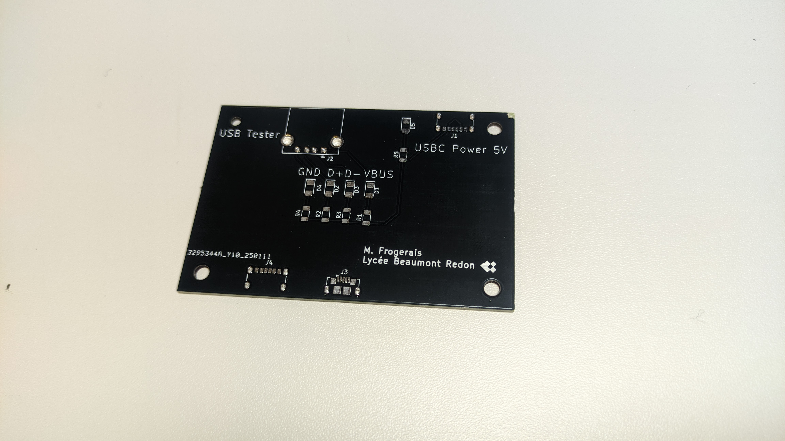
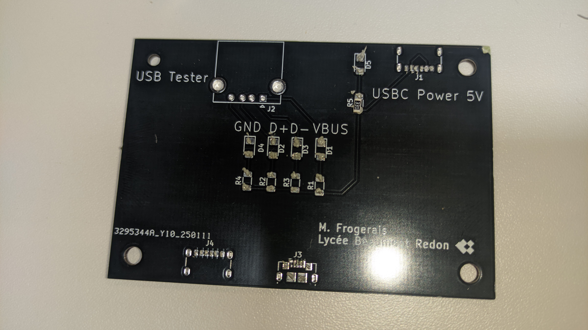
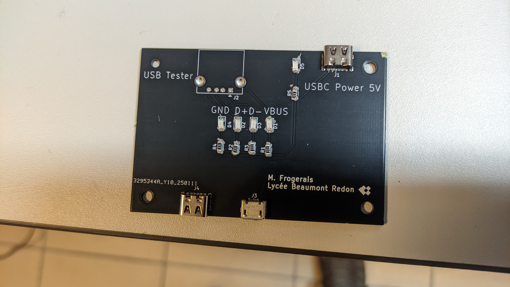
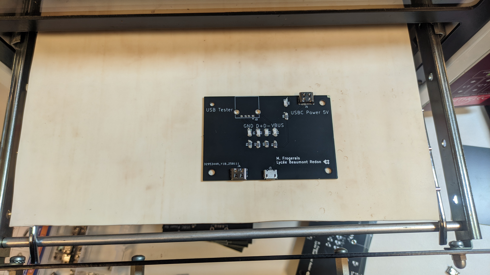
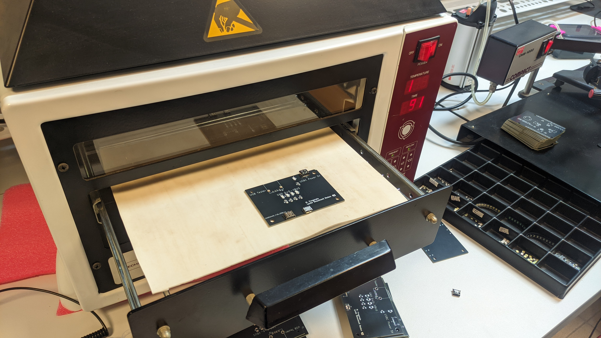
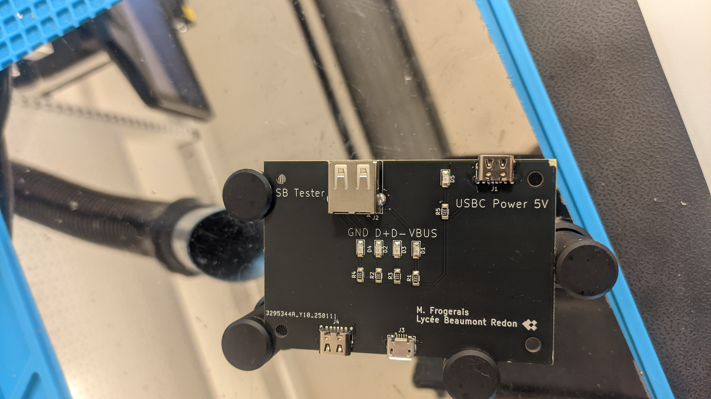
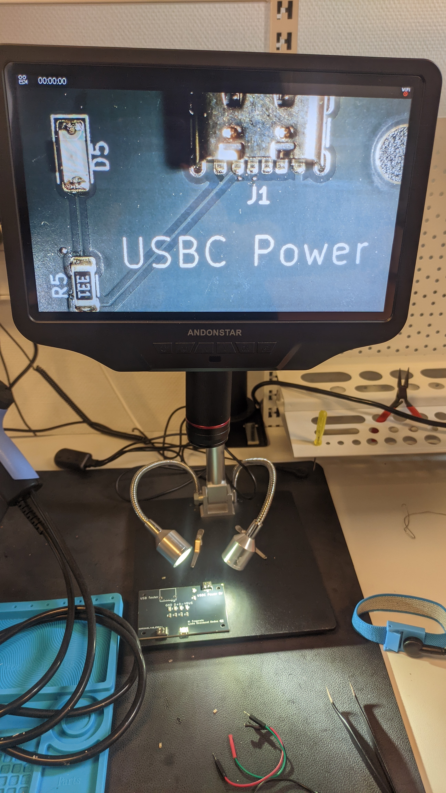
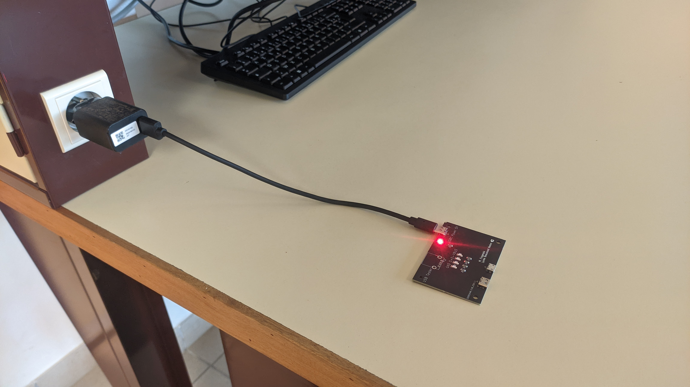

# Dossier de conception USB Tester 

Voici un guide étape par étape pour concevoir et assembler la carte électronique intégrant des composants CMS (résistances et LED, quelques connecteurs  montés en surface) ainsi que des composants traversants . Ce procédé  inclut l'application manuelle de pâte à braser et le passage en four à refusion sans utilisation de stencil.

## 2. Nomenclature

| Reference | Value          | Qty |
| --------- | -------------- | --- |
| D1        | LED Jaune      | 1   |
| D2        | LED Jaune      | 1   |
| D3        | LED Jaune      | 1   |
| D4        | LED Jaune      | 1   |
| D5        | LED Rouge      | 1   |
| J1, j4    | Conn. USBC     | 2   |
| J2        | Conn. USBA     | 1   |
| J3        | Conn. USBmicro | 1   |

## 4. Préparation à l’Assemblage

- **Nettoyage du PCB :**
  - Assurez-vous que la carte est propre et exempte de poussière ou d’empreintes.
- **Mise en place du poste de travail :**
  - Organisez votre matériel : pâte à braser (en seringue), fer à souder pour les composants traversants, four à refusion.
- **Documentation :**
  - Imprimez le schéma et/ou un plan de positionnement (layout) pour guider le placement des composants.

# Brasage des composants

 

## 1. Application de la Pâte à Braser (Sans Stencil)

 

- **Utilisation d’une seringue :**
  - À l’aide d’une seringue, déposez manuellement la pâte à braser sur chaque zone de montage des composants CMS.
  - Veillez à appliquer la quantité appropriée pour chaque pad afin d’éviter les ponts de soudure ou les soudures insuffisantes.
- **Précision :**
  - Pour les zones très fines, utilisez une seringue à embout fin et, si besoin, une loupe pour vérifier l’exactitude de l’application.

## 6. Placement des Composants CMS

- **Positionnement :**
  - Placez délicatement les composants CMS (résistances, LED, etc.) sur les pads recouverts de pâte.
  - Vérifiez l’alignement et l’orientation (notamment pour les composants polarisés comme certaines LED).
- **Ajustement :**
  - Corrigez la position des composants si nécessaire avant le passage en four.

## 7. Passage en Four à Refusion

- **Programmation de la courbe de chauffe :**

  - Programmez le four à refusion selon une courbe de température adaptée (phase de préchauffage, pic de température, et refroidissement contrôlé).

- **Refusion :**
  - Placez la carte dans le four et lancez le cycle.
  - Surveillez le processus pour vous assurer que la pâte à braser fond correctement et forme des joints solides.
- **Refroidissement :**
  - Laissez la carte refroidir progressivement pour éviter les contraintes thermiques.

## 8. Soudure des Composants Traversants

- **Placement manuel :**
  - Après la refusion des composants CMS, positionnez les composants traversants (connecteurs USB ) sur la carte.
- **Soudure :**
  - Utilisez un fer à souder pour souder manuellement ces composants.
  - Assurez-vous de réaliser des soudures nettes et sans ponts.

## 9. Inspection et Tests

- **Contrôle visuel :**

  - Inspectez la carte à l’aide d’une loupe ou d’un microscope pour vérifier la qualité des soudures (absence de ponts, bonne homogénéité des joints).
- **Retouches éventuelles :**
  - Réalisez des retouches manuelles si vous constatez des défauts.
- **Tests fonctionnels :**
  - Alimentez la carte et vérifiez le bon fonctionnement de l’ensemble du circuit (LED, buzzer, connecteur Arduino).
  - Mesurez les tensions et vérifiez la continuité des pistes si nécessaire.

